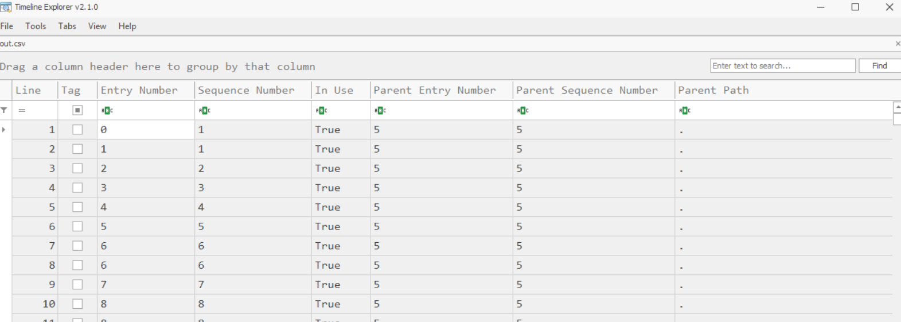
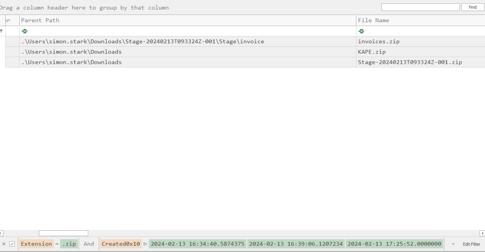
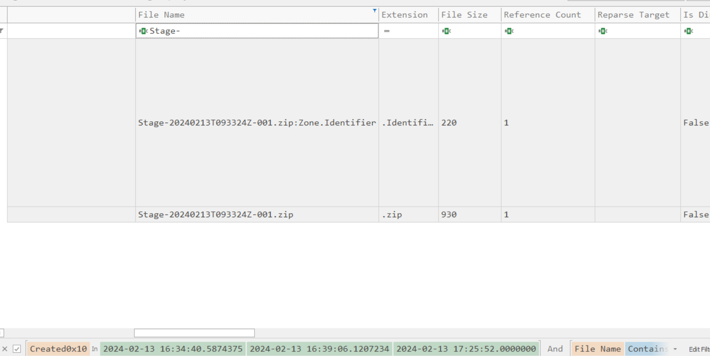
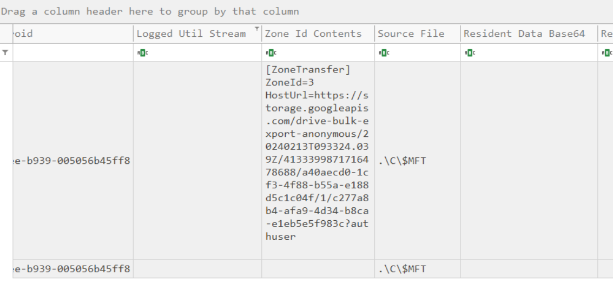
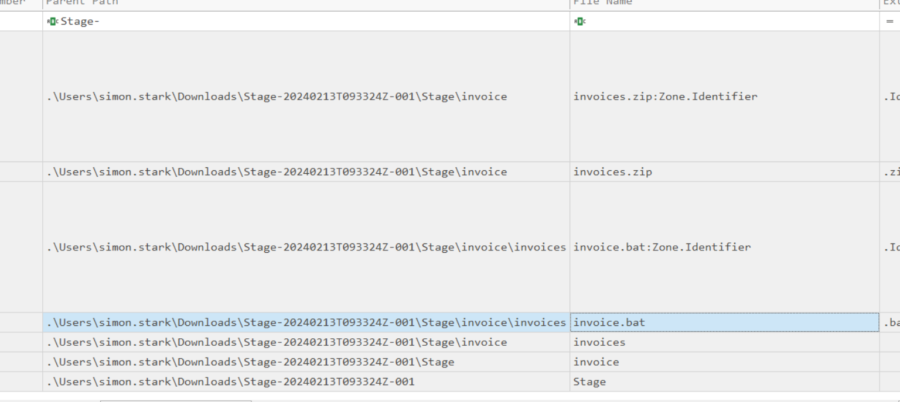
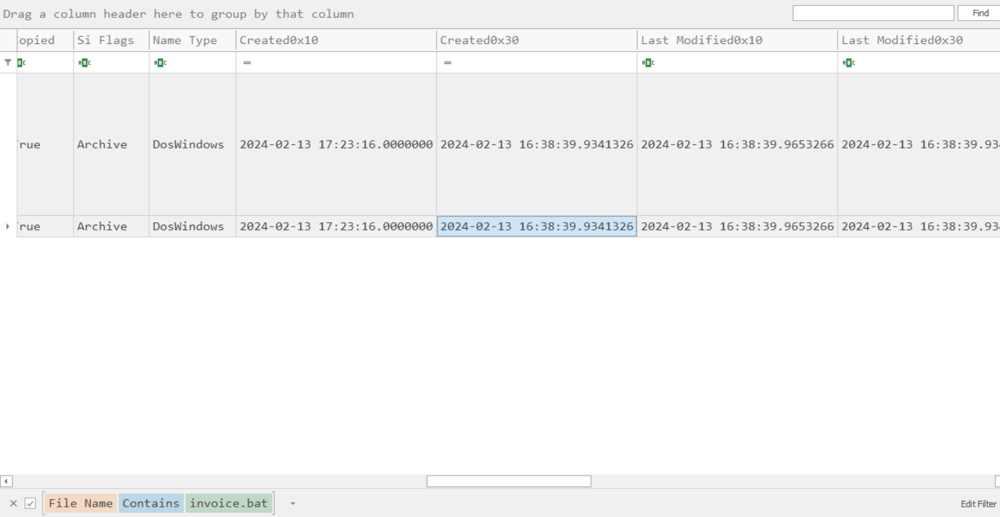
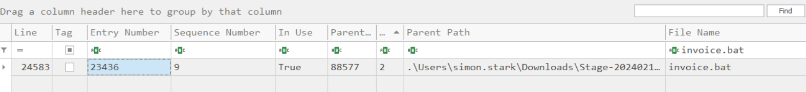
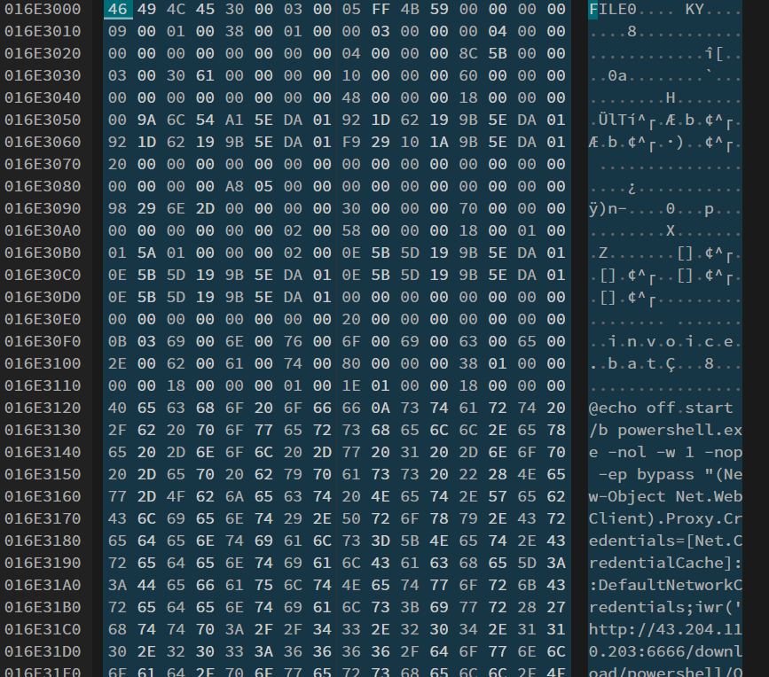

* **Machine Author(s):** Cyberjunkie
* **Difficulty:** Very Easy

## Sherlock Scenario

In this Sherlock, you will become acquainted with MFT (Master File Table) forensics. You will be introduced to well-known tools and methodologies for analyzing MFT artifacts to identify malicious activity. During our analysis, you will utilize the MFTECmd tool to parse the provided MFT file, TimeLine Explorer to open and analyze the results from the parsed MFT, and a Hex editor to recover file contents from the MFT.

## Artifacts Provided

* BFT.zip (zip file), sha256: `4576e3f020b9f0a1744d88fadda8371efd7cfd4c8a9db17bafae21c14118a2e9`

## Initial Analysis

After unzipping the provided file, we obtain one artifact:

* `C` directory with an `$MFT` file inside

### MFT

In NTFS (New Technology File System) volumes, the MFT is a centralized registry where the Operating System records all information about every file or directory in a volume.

When you click on a directory or search for a file, Windows does not search the entire disk; instead, it consults the MFT to determine:

* The name of the file
* The size of the file
* Timestamps (creation, modification, access)
* Permissions
* Physical location

For forensics, the MFT is an important artifact that allows us to:

* **Recover deleted files:** When a file is deleted in Windows, the actual content (the bytes) remains on the disk, and the corresponding MFT record is only marked as "inactive".
* **Timestomping Detection:** Criminals often alter the creation date of malware to make it appear as an older file on the system. We can use the MFT to detect if timestamps have been manipulated.
* **Timeline:** We can use the MFT to create a timeline of the invasion, identify which directories were infected, and determine which tools were used.
* **Identifications of Alternative Data Streams (ADS):** With MFT, we can look for additional $DATA attributes that indicate the presence of hidden files (a common technique in malware and data exfiltration).

### Field in MFT

| Attribute Name | Technical Description | Forensic Use Case |
|----------------|----------------------|------------------|
| `$STANDARD_INFORMATION` | MACB timestamps: stores Modified, Accessed, Created and Entry Modified times, along with file flags (Hidden, System, etc.). | Timeline analysis: reconstructs user activity and file access history. |
| `$ATTRIBUTE_LIST` | Attribute references: lists attributes that do not fit inside the primary 1 KB MFT record. | Indicates complex or highly fragmented files and extensive metadata or ADS. |
| `$FILE_NAME` | File metadata: stores filename, parent directory reference, and a second set of MACB timestamps. | Detects timestomping and helps track file renaming or movement. |
| `$OBJECT_ID` | Unique identifier: 64-byte GUID used by Windows to track files internally. | Allows tracking files even if they are renamed or moved across volumes. |
| `$SECURITY_DESCRIPTOR` | Security metadata: contains Owner SID, Access Control Lists (ACLs), and audit settings. | Determines access permissions and detects unauthorized privilege changes. |
| `$VOLUME_NAME` | Volume label: stores the friendly name of the partition (e.g., “Local Disk C”). | Confirms volume identity in multi-disk forensic investigations. |
| `$VOLUME_INFORMATION` | Volume metadata: NTFS version, volume serial number, and system flags (e.g., Dirty bit). | Links activities to a specific volume and detects improper unmounts. |
| `$DATA` | File content: stores file data (resident) or pointers to disk clusters (non-resident). | Enables direct file analysis and recovery of deleted or exfiltrated data. |
| `$INDEX_ROOT` | Directory index root: root node of the NTFS directory indexing structure. | Helps reconstruct directory hierarchy and file organization. |
| `$INDEX_ALLOCATION` | Directory index structure: B-Tree used to manage filenames in large directories. | Allows forensic tools to enumerate files in large directories. |
| `$BITMAP` | Allocation map: indicates which clusters or MFT records are allocated or free. | Assists in reconstructing files from unallocated disk clusters. |
| `$REPARSE_POINT` | Link metadata: stores information about symbolic links, junctions, or cloud files. | Detects redirections to external or hidden storage locations. |
| `$EA_INFORMATION` | Extended attribute metadata: describes legacy Extended Attributes. | Indicates additional metadata used for legacy compatibility. |
| `$EA` | Extended attribute data: contains the actual content of Extended Attributes. | Provides extended metadata used by legacy systems. |
| `$LOGGED_UTILITY_STREAM` | Transactional NTFS data: logs temporary file changes during transactions (TxF). | Helps analyze intermediate states after crashes or interrupted operations. |

## Questions

### Task 1: Simon Stark was targeted by attackers on February 13. He downloaded a ZIP file from a link received in an email. What was the name of the ZIP file he downloaded from the link?

Before we can search for the ZIP filename, we will use the MFTECmd to parse the provided MFT file.

```cmd
 .\MFTECmd.exe -f ".\C\Directory\`$MFT" --csv ".\C\OutputDirectory\out"  --csvf "out.csv"
```

With the `out.csv`file, we can now use the TimeLine Explorer to answer the questions.



Filtering for `.zip` in the Extension column and for files created on February 13, we have these 3 ZIP files:



Because one of the files is a parent directory of the filtered files, and the other is a ZIP file for the KAPE program, we can identify the malicious ZIP file as `Stage-20240213T093324Z-001.zip`.

**Answer:** `Stage-20240213T093324Z-001.zip`.

### Task 2: Examine the Zone Identifier contents for the initially downloaded ZIP file. This field reveals the HostUrl from where the file was downloaded, serving as a valuable Indicator of Compromise (IOC) in our investigation/analysis. What is the full Host URL from where this ZIP file was downloaded?

We can remove the `.zip` extension filter and search for files with the name "Stage-" to find the Zone Identifier file for the malicious ZIP.



If we examine the Zone ID Contents, we can see the HostUrl where the file was downloaded



**Answer:** `https://storage.googleapis.com/drive-bulk-export-anonymous/20240213T093324.039Z/4133399871716478688/a40aecd0-1cf3-4f88-b55a-e188d5c1c04f/1/c277a8b4-afa9-4d34-b8ca-e1eb5e5f983c?authuser`.

### Task 3: What is the full path and name of the malicious file that executed malicious code and connected to a C2 server?

> **Hint:** Identify any suspicious file related to the initially downloaded ZIP file. Look for MFT records with suspicious extensions and timestamps around the ZIP download time.

Filtering for files with "Stage-" as the parent name and timestamps around the time of the malicious ZIP file, we can identify a suspicious `.bat` file.



`.bat` files can be used to reach a C2 server. While they are often considered legacy, they are commonly used for executing commands on Windows systems. They can be utilized as initial stagers to download and execute more complex malware, such as Remote Access Trojans (RATs).

With that information, we can see the full Path for the `.bat` file using the Parent Path column `C:\Users\simon.stark\Downloads\Stage-20240213T093324Z-001\Stage\invoice\invoices\invoice.bat`.

**Answer:** `C:\Users\simon.stark\Downloads\Stage-20240213T093324Z-001\Stage\invoice\invoices\invoice.bat`.

### Task 4: Analyze the $Created0x30 timestamp for the previously identified file. When was this file created on disk?

$Created0x10 can be easily altered using user tools or malware through timestomping. However, $Created0x30 is crucial for digital forensics because it cannot be altered by tools (only by the Operating System) and reflects the exact creation time of the file.

Filtering for the `invoice.bat` file and removing other timestamp filters, we can see the file was created at `2024-02-13 16:38:39`.



**Answer:** `2024-02-13 16:38:39`.

### Task 5: Finding the hex offset of an MFT record is beneficial in many investigative scenarios. Find the hex offset of the stager file from Question 3

> **Hint:** In MFT records, find the Entry Number value for the file in question. Multiply that number by 1024 (since this is the size of each record). The result is the offset in Decimal. Convert it to hex to find your answer.

Find the hex offset for the `invoice.bat` file, we need the Entry Number of the file. We can obtain the Entry Number for the `.bat` file in the Entry Number column:



Multiplying 23436 with 1024, and converting into hexadecimal we have `16E3000`.


**Answer:** `16E3000`.

### Task 6: Each MFT record is 1024 bytes in size. If a file on disk has smaller size than 1024 bytes, they can be stored directly on MFT File itself. These are called MFT Resident files. During Windows File system Investigation, its crucial to look for any malicious/suspicious files that may be resident in MFT. This way we can find contents of malicious files/scripts. Find the contents of The malicious stager identified in Question3 and answer with the C2 IP and port

> **Hint:** Open the MFT file in any hex editor tool of your choice. Then, either search for or jump to the offset identified in the previous question to find the stager file contents. For example, in the HxD (Hex editor) tool, go to the search tab and click the "go to" button, which opens up a prompt where you can input either hex or decimal offset to navigate to the relevant location.

We can see in the File Size column that the `invoice.bat` file is less than 1024 bytes, indicating that it can be stored directly within the MFT record itself.

Opening the `$MFT` file in a hex editor tool and jumping to the `16E3000` hexadecimal offset, we can see a PowerShell script from which we can extract the C2 IP address and port: `43.204.110.203:6666`.



**Answer:** `43.204.110.203:6666`.
