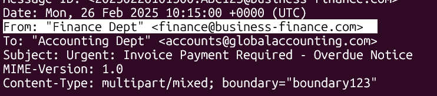
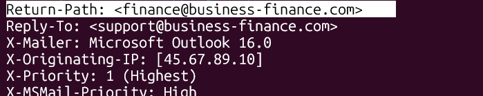
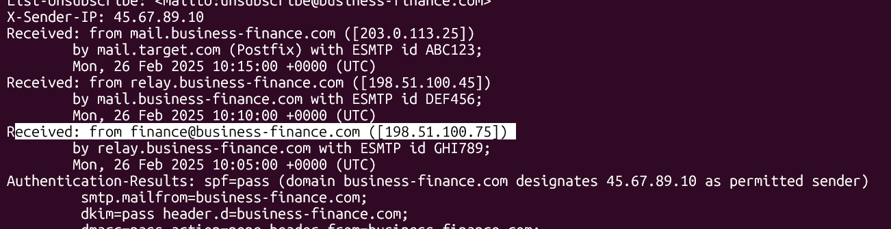
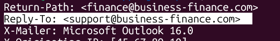
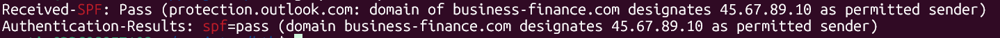
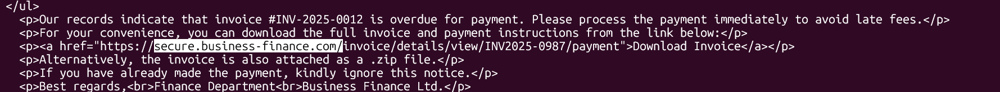
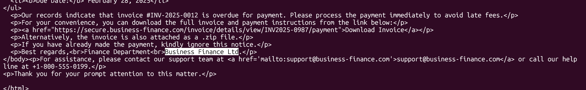
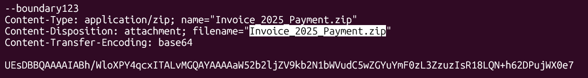
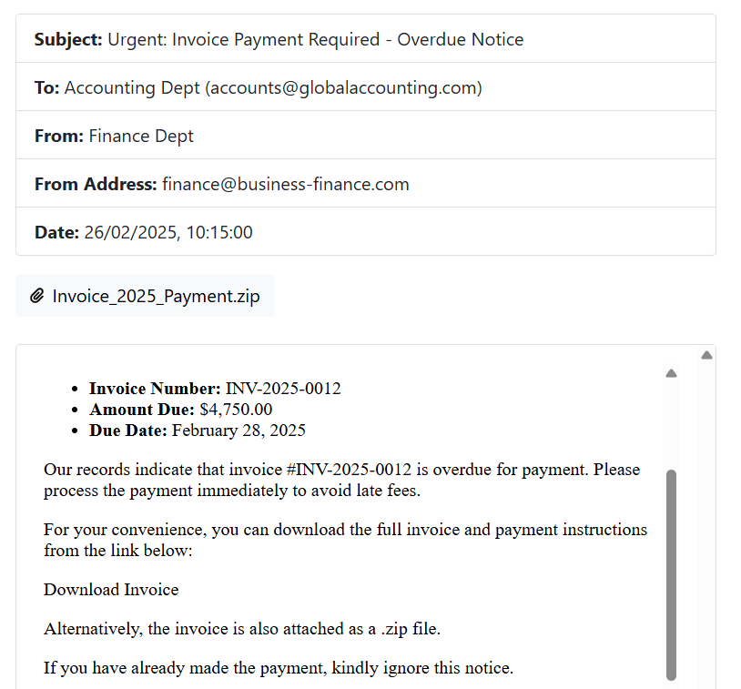
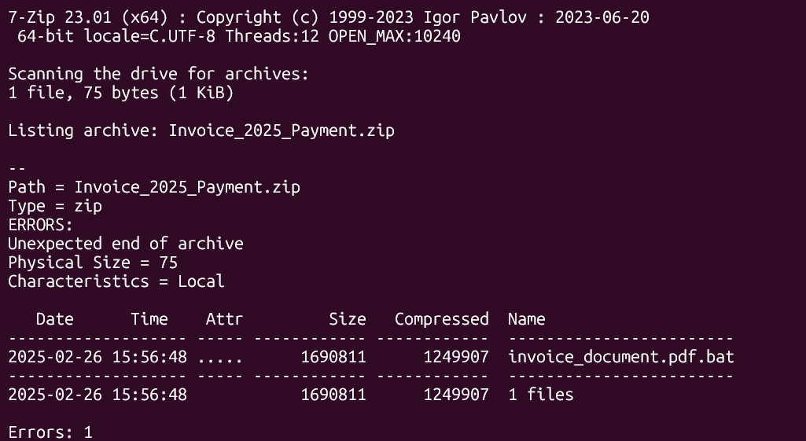

* **Machine Author(s):** OxAlpha4040
* **Difficulty:** Very Easy

## Sherlock Scenario

This Sherlock case involves a phishing attack where an attacker impersonates a known vendor to deceive an accounting team. The email, designed to appear legitimate, includes an urgent payment request and a ZIP attachment containing malware. By analyzing the email's headers and content, investigators can identify the phishing tactics used and the potential risks involved. This case underscores the need for careful scrutiny of unexpected emails and attachments to prevent security breaches.

## Artifacts Provided

* PhishNet.zip (zip file), sha256: `7d5621c46502fe5badf62137bb9340898e712fd3915d220022f9db046defd4d5`

## Initial Analysis

After unzipping the provided file, we obtain this file:

* `email.eml` - Email message

### EML

EML files were developed so that messages can be saved, moved, and read independently of the original email server. It is a plain text file that contains a structured electronic message. They are often used to back up important emails or archive specific threads, facilitating the migration or sharing of individual messages.

With EML files, we can:

* **Backup and Storage:** Save and store important emails locally or remotely, independent of the original email provider.
* **Cross-platform Transfer:** Export an email from one client and open it with another without losing the original formatting.
* **Send as Attachments:** Attach an `.eml` file to another email to forward a conversation while preserving all original metadata.
* **Forensic Analysis:** Access critical data from the complete headers, which is essential for forensic investigations to trace the origin and path of a message.

### Fields in an EML file

The EML file is divided into three principal parts:

* **Headers:** Technical details like sender, recipient, date, subject, and server timestamps.
* **Body of the message:** The principal text, it can be in plain text or HTML.
* **Attachments:** If the original email has a photo or PDF, it is encoded (usually in Base64) and embedded within the `.eml` itself.

## Questions

### Task 1: What is the originating IP address of the sender?

We can find the originating IP address in the header of the EML file. The header of the file contains the initial technical metadata that can be used in our study, and it starts on the first line and ends exactly before the first double newline.


In the header we can see `X-Originating-IP` is `45.67.89.10`.


This field is optional (use of the X in the name field), and normally indicates the originating IP from the sender, but it could be forged.

**Answer:** `45.67.89.10`.

### Task 2: Which mail server relayed this email before reaching the victim?

To identify the server that relayed this email before it reached the victim, we need to see the first `Received` field:


We need the first one because the register of the sending is stacked. With that, we see the IP of the mail server is `203.0.113.25`.

**Answer:** `203.0.113.25`.

### Task 3: What is the sender's email address?

To see what the sender's email is, we need to look for the `From` field in the email.



Because the `From` field could be forged, we need to also see the `Return-Path` and the last `Received` field. This is because the `Return-Path` is where the email returns when the email was not delivered, and the `Received` field shows the IP and the machine's name of the origin message.





With that information, we can see that the sender's email is `finance@business-finance.com`.

**Answer:** `finance@business-finance.com`.

### Task 4: What is the 'Reply-To' email address specified in the email?

The reply-to email can be seen in the second line of the file: `support@business-finance.com`.



**Answer:** `support@business-finance.com`.

### Task 5: What is the SPF (Sender Policy Framework) result for this email?

The SPF can be retrieved with

```bash
grep -i "spf" email.eml
```



In both fields above, we can see that the SPF result is `pass`.

**Answer:** `pass`.

### Task 6: What is the domain used in the phishing URL inside the email?

The domain used in the URL can be seen in the body of the email:



With that, the domain is `secure.business-finance.com`.

**Answer:** `secure.business-finance.com`.

### Task 7: What is the fake company name used in the email?

The fake company name can also be seen in the body of the email:



With that, the company name used is `Business Finance LTD`.

**Answer:** `Business Finance LTD`.

### Task 8: What is the name of the attachment included in the email?

The name of the attachment can be seen in the attachments of the email:



With that, the name of the attachment is `Invoice_2025_Payment.zip`.

**Answer:** `Invoice_2025_Payment.zip`.

### Task 9: What is the SHA-256 hash of the attachment?

To get the SHA-256 of the attachment, we need to get the `.zip` file from the email.

For that, we can use any email client and open the eml file:



or use a tool, like `ripMIME`, to extract the `.zip` file

```bash
ripmime -i email.eml -d ./outputdirectory
```

With the `.zip` file, we can now get the SHA-256 of the attachment

```bash
sha256sum Invoice_2025_Payment.zip
```


We can see that the SHA-256 is `8379c41239e9af845b2ab6c27a7509ae8804d7d73e455c800a551b22ba25bb4a`.

**Answer:** `8379c41239e9af845b2ab6c27a7509ae8804d7d73e455c800a551b22ba25bb4a`.

### Task 10: What is the filename of the malicious file contained within the ZIP attachment?

We can see the file in the `.zip` file with the `7z`:

```bash
7z l Invoice_2025_Payment.zip
```



With that, we can see the filename is `invoice_document.pdf.bat`.

**Answer:** `invoice_document.pdf.bat`.

### Task 11: Which MITRE ATT&CK techniques are associated with this attack?

For this task, we need to search the [ATT&CK Matrix for Enterprise](https://attack.mitre.org/matrices/enterprise/) to locate the Phishing ID related to the attack.


Because was used an malitius attachment file, the ID related to the attack is `T1566.001`.

**Answer:** `T1566.001`.
