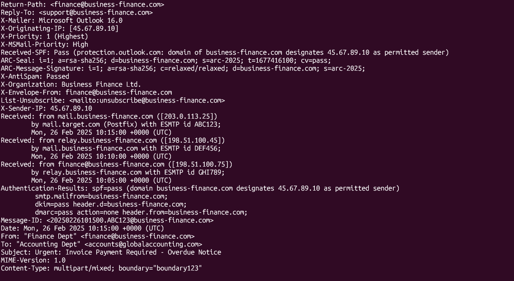

* **Machine Author(s):** OxAlpha4040
* **Difficulty:** Very Easy

## Sherlock Scenario

This Sherlock case involves a phishing attack where an attacker impersonates a known vendor to deceive an accounting team. The email, designed to appear legitimate, includes an urgent payment request and a ZIP attachment containing malware. By analyzing the email's headers and content, investigators can identify the phishing tactics used and the potential risks involved. This case underscores the need for careful scrutiny of unexpected emails and attachments to prevent security breaches.

## Artifacts Provided

* PhishNet.zip (zip file), sha256: `7d5621c46502fe5badf62137bb9340898e712fd3915d220022f9db046defd4d5`

## Initial Analysis

After unzipping the provided file, we obtain this file:

* `email.eml` - Email mesager

### EML

EML files were developed so that messages can be saved, moved, and read independently of the original email server. It is a plain text file that contains a structured electronic message. They are often used to back up important emails or archive specific threads, facilitating the migration or sharing of individual messages.

With EML files, we can:

* **Backup and Storage:** Save and store important emails locally or remotely, independent of the original email provider.
* **Cross-platform Transfer:** Export an email from one client and open it with another without losing the original formatting.
* **Send as Attachments:** Attach an `.eml` file to another email to forward a conversation while preserving all original metadata.
* **Forensic Analysis:** Access critical data from the complete headers, which is essential for forensic investigations to trace the origin and path of a message.

### Field in an EML file

The EML file is divided in three principal parts:

* **Headers:** Tecnical details like sender, reciptor, date, subject, and server timestamps.
* **Body of the mesager:** The principal text, it can be in plain text or HTML.
* **Atachments:** If in the original e-mail have an foto or PDF, it is encoded (usually in Base64) and embdded within the `.eml` itself.

## Questions

### Task 1: What is the originating IP address of the sender?

We can find the originating IP address in the header of the EML file. The header of the file contains the initial technical metadata that can be used in our study, and initiates in the firs line and ends exactly before the first double end line.

In the header we can see ``X-Originating-IP` is `45.67.89.10`

This field is optional (use of the X in the name field), and normaly indicate the Originated IP from the sender but it could be manipulated.

**Answer:** `45.67.89.10`.

### Task 2: Which mail server relayed this email before reaching the victim?

To identify the server rayed this e-mail, we need to see the first `Received` field:

### Task 3: What is the sender's email address?

### Task 4: What is the 'Reply-To' email address specified in the email?

### Task 5: What is the SPF (Sender Policy Framework) result for this email?

### Task 6: What is the domain used in the phishing URL inside the email?

### Task 7: What is the fake company name used in the email?

### Task 8: What is the name of the attachment included in the email?

### Task 9: What is the SHA-256 hash of the attachment?

### Task 10: What is the filename of the malicious file contained within the ZIP attachment?

### Task 11: Which MITRE ATT&CK techniques are associated with this attack?
