* **Machine Author(s):** CyberJunkie
* **Difficulty:** Very Easy

## Sherlock Scenario

In this Sherlock, you will familiarize yourself with Sysmon logs and various useful EventIDs for identifying and analyzing malicious activities on a Windows system. Palo Alto's Unit42 recently conducted research on an UltraVNC campaign, wherein attackers utilized a backdoored version of UltraVNC to maintain access to systems. This lab is inspired by that campaign and guides participants through the initial access stage of the campaign.

## Artifacts Provided

* unit42.zip (zip file), sha256: `c44d7b109f766b7b977a77e1c74c5f68b928bface935fb2b5a574c1585c58b2a`

## Initial Analysis

After unzipping the provided file, we obtain this file:

* `Microsoft-Windows-Sysmon-Operational.evtx` - a Windows XML Event Log.

### EVTX

An EVTX file is a Windows XML Event Log, where the operating system records a wide range of information about every event that occurs on the system, from system startups and shutdowns to software installations and security breaches.

Its principal function is for audit and assessment, and it helps to respond to three critical questions: "What happened?", "When did it happen?" and "Who did it?".

They are divided into two big categories: "Windows Logs" that cover core OS events and "Application and Services Logs" that provide detailed component-specific logs.

#### Windows Logs

They are legacy logs and they are the most important to monitor the health and the security of the machine

* **Security Log (`Security.evtx`):** Tracks authentication attempts, logins, and audit policies.
* **System Log (`System.evtx`):** Captures OS component issues, service failures, and drivers errors.
* **Application Log (`Application.evtx`):** Records events generated by installed software and programs
* **Setup Log (`Setup.evtx`):** Records installations and update events.
* **Forwarded Events:** Used to store events from remote computers.

#### Application and Services Logs

It's a more granular category. Windows creates a specific `.evtx` file for almost every sub-service

* **Microsoft-Windows-PowerShell/Operational:** Crucial to detect invaders. Registers which commands PowerShell executed on the machine.
* **Microsoft-Windows-Sysmon/Operational (If Sysmon is installed):** Gives detailed connections of the network and the creation of files.
* **Microsoft-Windows-TerminalServices-RemoteConnectionManager:** Registers RDP connections.
* **Microsoft-Windows-WLAN-AutoConfig:** Registers connections and disconnections in Wi-Fi networks.

#### Log Levels (Severity)

Inside each of the `.evtx` files, the logs are classified by severity to help identify the urgency of an action:

* **Information:** Common successful events (e.g., a service started).
* **Warning:** Indicates a non-ideal state that doesn't yet break the system.
* **Error:** A critical problem where a service or app fails to load.
* **Critical:** A serious failure that may cause a system shutdown or data loss.
* **Success/Failure Audit:** Exclusive to the Security log (e.g., correct vs. wrong password).

#### Viewing Windows Event Logs

We can use the Event Viewer (`eventvwr.msc`) to read the `.evtx` file. It organizes the logs into a tree interface where you can filter for data, error level, or event ID.

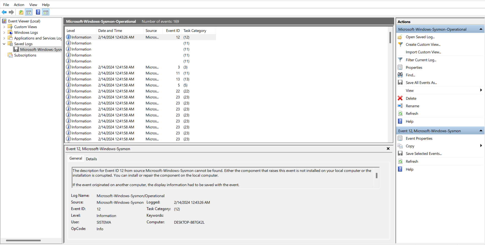

We can also use other tools to analyze the logs like:

* **Eric Zimmerman's EvtxECmd:** A CLI tool that converts EVTX logs into CSV or JSON for analyses.
* **Event Log Explorer:** A faster alternative to Event Viewer with advanced filters.
* **PowerShell:** We can use the `Get-WinEvent` cmdlet to quickly extract specific data.

### Sysmon (System Monitor)

Since the Sherlock scenario focuses on Sysmon logs, it is essential to understand its role.

Sysmon is an advanced Microsoft Sysinternals tool that provides deep visibility into Windows activity by monitoring and logging detailed system events to the Windows Event Log. Unlike standard Windows logs, Sysmon operates using a device driver (Kernel Mode) to intercept system calls and a service (User Mode) to process and write these events.

It fills critical visibility gaps by tracking process creation (with full command lines and hashes), network connections, file modifications, and DLL loads. This level of granularity is indispensable for Threat Hunting and Forensic Analysis, as it allows investigators to reconstruct the exact sequence of an attacker's actions.

Each specific activity is categorized by a unique Event ID within the Microsoft-Windows-Sysmon/Operational log. These IDs provide the high-fidelity forensic data necessary to identify malicious patterns that standard OS logging often misses.

Some Key Sysmon Event IDs include:

| Event ID | Description | Why It’s Useful |
| -------- | ----------- | --------------- |
| 1 | **Process Creation** | Logs every new process, helping identify suspicious executables. |
| 2 | **File Creation Time Changed** | Logs file creation time changes that may hide when it was created or modified. |
| 3 | **Network Connection** | Tracks network connections made by processes, useful for detecting malicious communication. |
| 5 | **Process Termination** | Logs when a process terminates. Useful for tracking the lifecycle of malicious or suspicious processes. |
| 8 | **CreateRemoteThread** | Logs when a process creates a remote thread in another process. This is often indicative of process injection or malicious activity. |
| 10 | **Process Access** | Logs when one process accesses another, which can indicate malicious activity like credential theft or process hollowing. |
| 11 | **File Creation** | Logs when a file is created or overwritten. Useful for detecting malware or scripts dropped onto a system. |
| 13 | **Registry Value Set** | Logs when a registry value is modified or created. Key for detecting registry-based persistence techniques. |
| 19 | **WMI Event Filter** | Logs when a WMI event filter is created. WMI can be used for persistence and lateral movement, making this useful for identifying malicious use. |
| 20 | **WMI Event Consumer Activity** | Logs when a WMI consumer is created. Attackers use WMI for persistence, so this helps in detecting it. |
| 22 | **DNS Query** | Logs DNS queries made by a process. Useful for detecting suspicious or unusual domain name lookups (e.g., command-and-control traffic). |
| 23 | **File Deletion** | Logs when a file is deleted. Helps track when attackers attempt to remove malicious files or cover their tracks. |

## Questions

### Task 1: How many Event logs are there with Event ID 11?

In the Event Viewer, we can group them by the Event ID

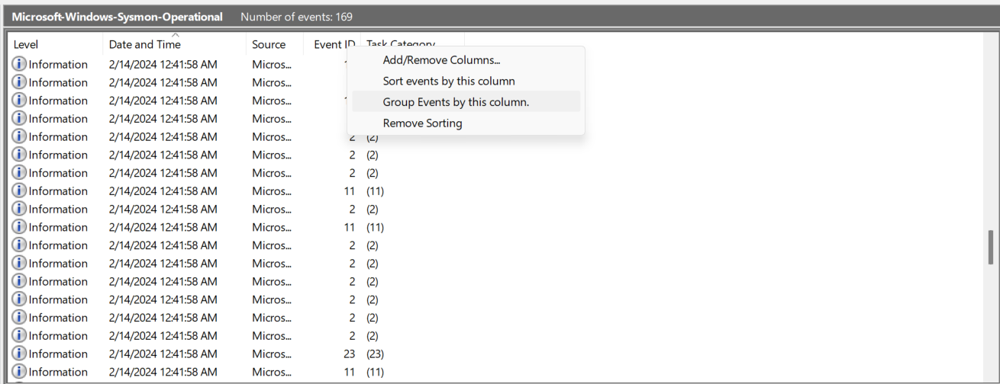

With that, we can see that we have `56` events with ID 11

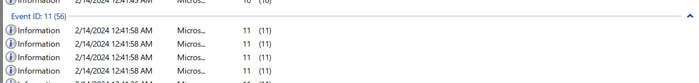

**Answer:** `56`.

### Task 2: Whenever a process is created in memory, an event with Event ID 1 is recorded with details such as command line, hashes, process path, parent process path, etc. This information is very useful for an analyst because it allows us to see all programs executed on a system, which means we can spot any malicious processes being executed. What is the malicious process that infected the victim's system?

With the grouping from Task 1, we can go into the Event ID 1 (Event ID for Process Creation) group and search for any suspicious file executing from odd directories.

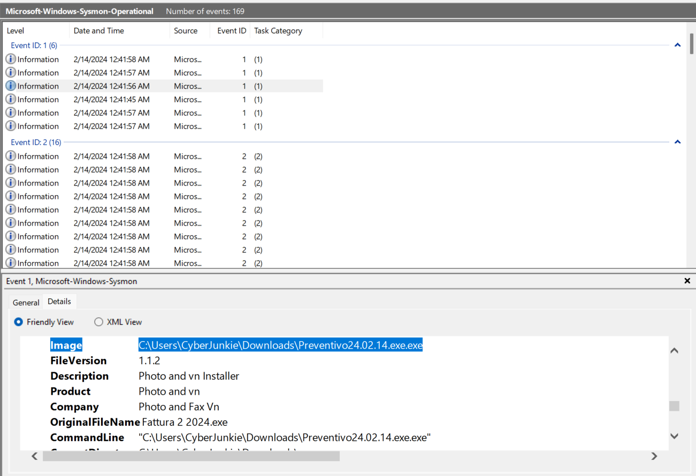

With the `Image` field, we can see a suspicious file `Preventivo24.02.14.exe.exe` was executed. This file is suspicious because it was running from an unusual directory `C:\Users\CyberJunkie\Downloads\` and it has two `.exe` extensions in the name.

Since we also have the SHA1, MD5, SHA256, and the ImpHash of the file with the `Hashes` field, we can also search on [VirusTotal](https://www.virustotal.com/) to see if the file is a known malicious file.

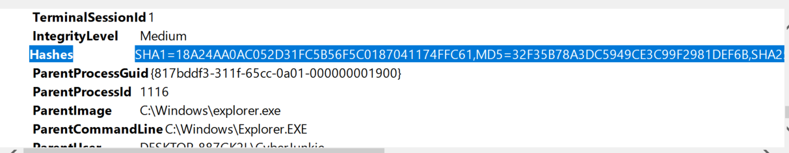

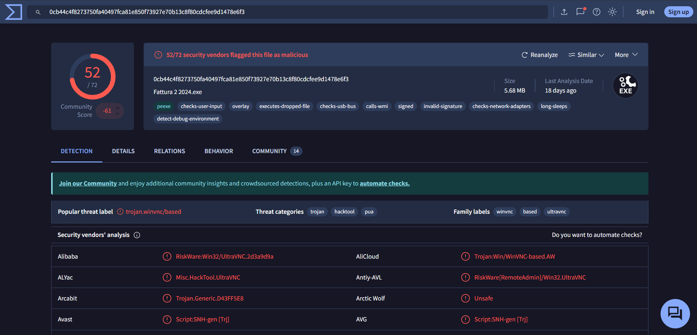

With all that information, we confirm that the process `C:\Users\CyberJunkie\Downloads\Preventivo24.02.14.exe.exe` is malicious.

**Answer:** `C:\Users\CyberJunkie\Downloads\Preventivo24.02.14.exe.exe`

### Task 3: Which Cloud drive was used to distribute the malware?

Since the task is about the cloud drive used, we can search in the Event ID 22 (Event ID for the DNS Query) to see which cloud drive was used.

We know that the name of the file was `Preventivo24.02.14.exe.exe`, so we can search for any Event ID 22 around an Event ID 11 (Event ID for File Creation) that is related to the malicious file.

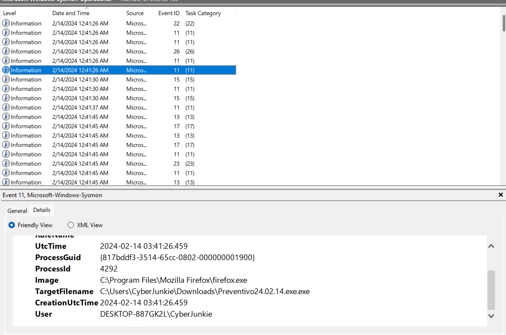

The file was created at `2024-02-14 03:41:26` and we have one Event with ID 22 around this time

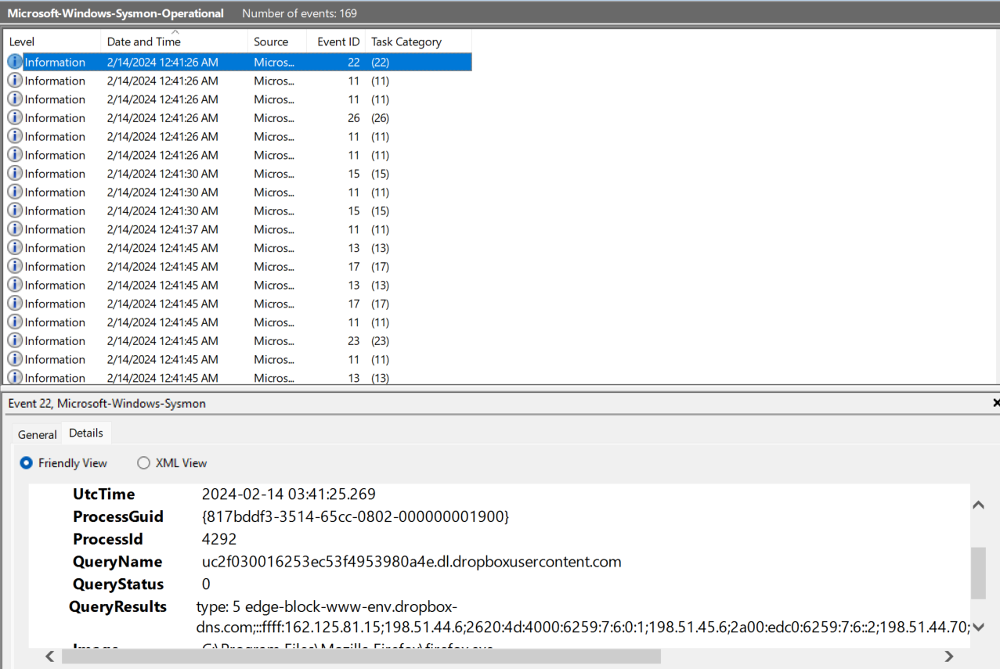

With that, we can see that the cloud drive used to distribute the malware was `Dropbox`.

**Answer:** `Dropbox`.

### Task 4: For many of the files it wrote to disk, the initial malicious file used a defense evasion technique called Time Stomping, where the file creation date is changed to make it appear older and blend in with other files. What was the timestamp changed to for the PDF file?

To see a timestamp change, we can use the Event ID 2 (Event ID for File Creation Time Changed).

Grouping the logs by Event ID and searching in the Event ID 2, we can see the timestamp changed for the `~.pdf` file.

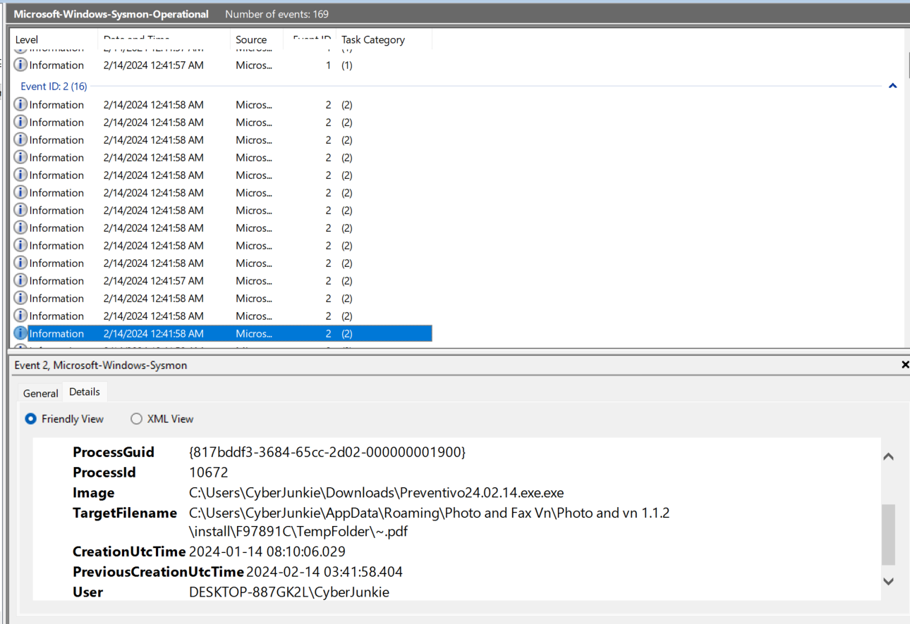

So, the timestamp changed to `2024-01-14 08:10:06` for the PDF file.

**Answer:** `2024-01-14 08:10:06`.

### Task 5: The malicious file dropped a few files on disk. Where was "once.cmd" created on disk? Please answer with the full path along with the filename.

To see where `once.cmd` was created, we can also use the Event ID 11 (Event ID for File Creation).

Grouping the logs by the Event ID, and going to the Events related to ID 11, we can search for the Event related to the malicious file in the `TargetFilename` field for `once.cmd` to get the path

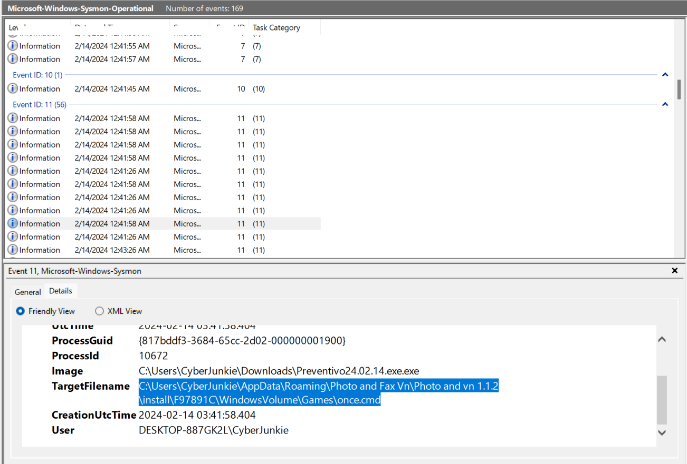

So, the full path where the `once.cmd` file was created is `C:\Users\CyberJunkie\AppData\Roaming\Photo and Fax Vn\Photo and vn 1.1.2\install\F97891C\WindowsVolume\Games\once.cmd`.

**Answer:** `C:\Users\CyberJunkie\AppData\Roaming\Photo and Fax Vn\Photo and vn 1.1.2\install\F97891C\WindowsVolume\Games\once.cmd`.

### Task 6: The malicious file attempted to reach a dummy domain, most likely to check the internet connection status. What domain name did it try to connect to?

To retrieve the domain name used, we can use the Event ID 22 (Event ID for the DNS Query).

Grouping the log by Event ID, and going to the Event ID 22 group, we can see that the malicious file attempted to reach `www.example.com`

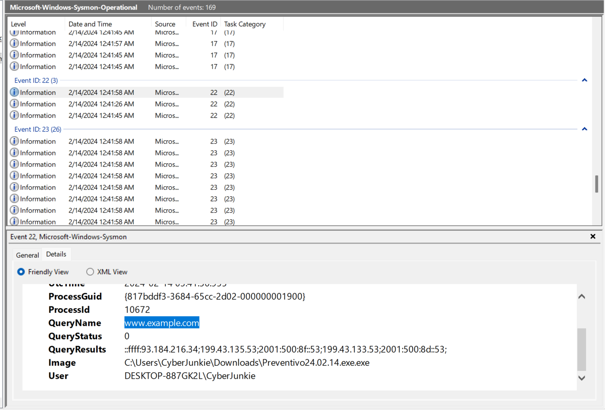

**Answer:** `www.example.com`.

### Task 7: Which IP address did the malicious process try to reach out to?

To see which IP address is used, we can use the Event ID 3 (Event ID for the Network Connection).

Grouping the log by the Event ID and going to the Event ID 3, we can see what IP the malicious process tried to reach by the `DestinationIP` field

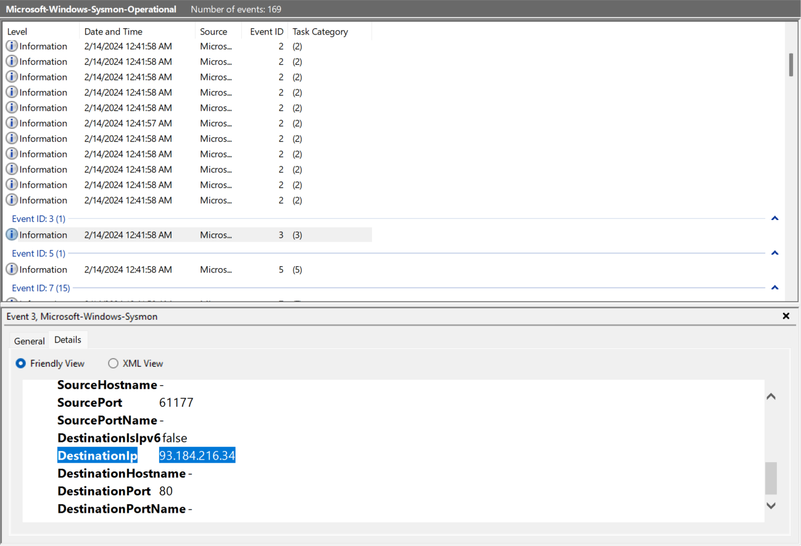

With that, we can see the IP was `93.184.216.34`.

**Answer:** `93.184.216.34`.

### Task 8: The malicious process terminated itself after infecting the PC with a backdoored variant of UltraVNC. When did the process terminate itself?

We can see when the malicious process terminated with the Event ID 5 (Event ID for the Process Termination).

Grouping by the Event ID, we can go to the Event ID 5 group to see when the malicious process ends.

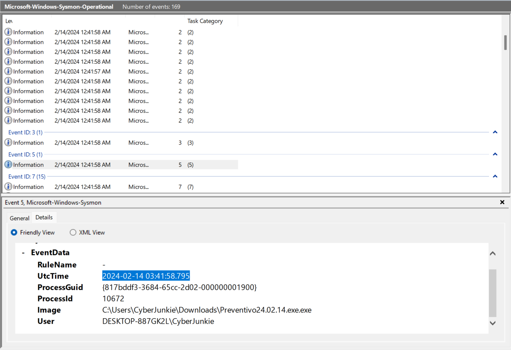

With that, we can see the process terminates at `2024-02-14 03:41:58`.

**Answer:** `2024-02-14 03:41:58`.
