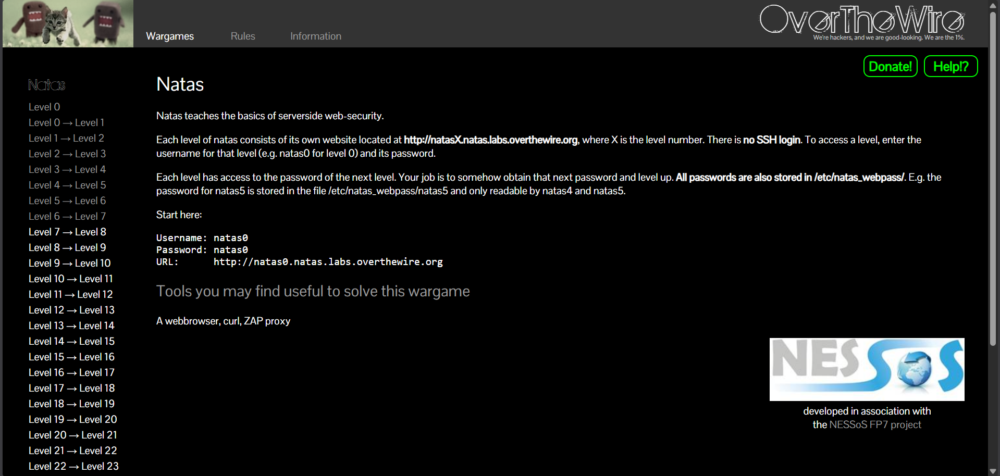
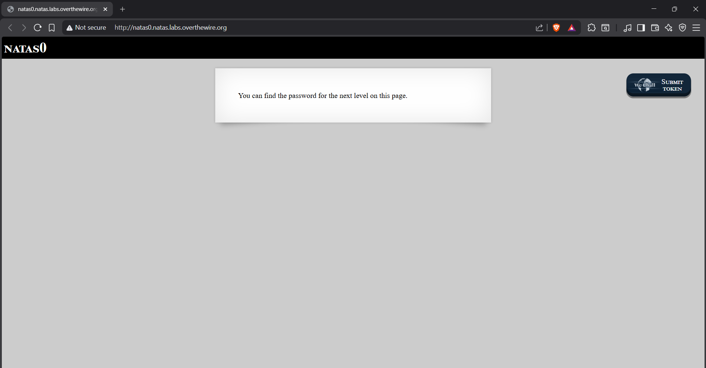
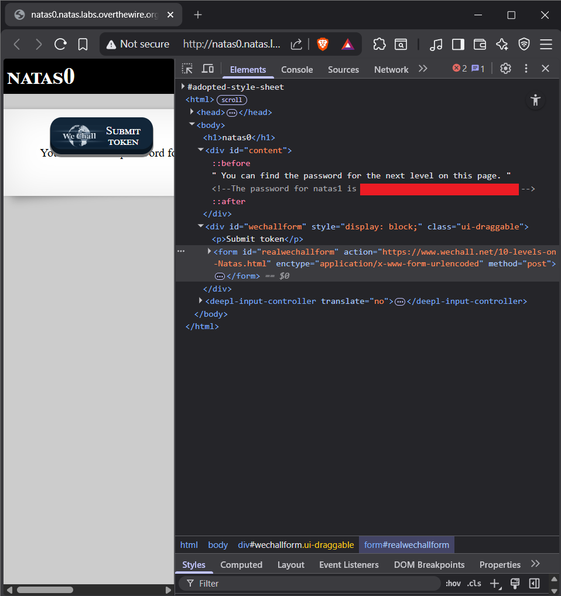

# Introduction

In a cybersecurity world where it’s so easy to just run an automation tool or chase the latest "hot" vulnerability, understanding the core concepts of a web app is what really separates the experts from the average analysts.

With that in mind, I’m starting a series of writeups for the **OverTheWire Natas wargame**. It's a classic for a reason: it's one of the best ways to learn the "bread and butter" of server-side web security.

# Why Natas, even if the content isn't brand new?

While Natas might not be the newest platform, it is excellent at what it proposes to teach. It forces us to focus on:

* **Request Manipulation:** Understanding how headers, cookies, and parameters can be exploited.
* **Logic Vulnerabilities:** Learning how server-side languages (e.g., PHP, Perl) can be bypassed or fooled.
* **Configuration Failures:** Identifying forgotten files, incorrect permissions, and exposed secrets.

For anyone pursuing a career in web security, understanding these flaws and exploits is fundamental.

# Before we start... 

Before jumping in, you should be comfortable with a few tools. If you’ve never used `curl` or aren't sure how a **cookie** actually works, Natas will be a fun way to learn! Just make sure you know some basic HTML first. You can check out [W3Schools](https://www.w3schools.com/html/) for a quick overview. 

I also recommend using Google or AI tools to research anything you don't understand. It is perfectly fine not to know everything immediately, and knowing how to search for answers is a superpower in security.

With that said, let's start with **Natas 0**.

# Natas 0 

When we open the Natas homepage, we see this:

Each level of Natas consists of its own website. To access a level, you need the specific username (e.g., **natas0** for Level 0) and its corresponding password.

The goal of each level is to find the password for the next level. Therefore, we need to find the password for Natas 1 hidden somewhere within the Natas 0 website.

Access the level here: [http://natas0.natas.labs.overthewire.org](http://natas0.natas.labs.overthewire.org) 

**Username:** natas0  
**Password:** natas0

# Solution

After entering the credentials, we are greeted with this page:

Since there is nothing obvious on the screen, let's check the **source code** of the page. There are several ways to do this:

* **Command Line:** Using tools like `curl` or `wget`.
* **Browser DevTools:** Pressing `F12` or `Ctrl+Shift+I`.

I’m using DevTools here. As soon as we open the inspector, the password for Natas 1 is right there, sitting in an HTML comment:

